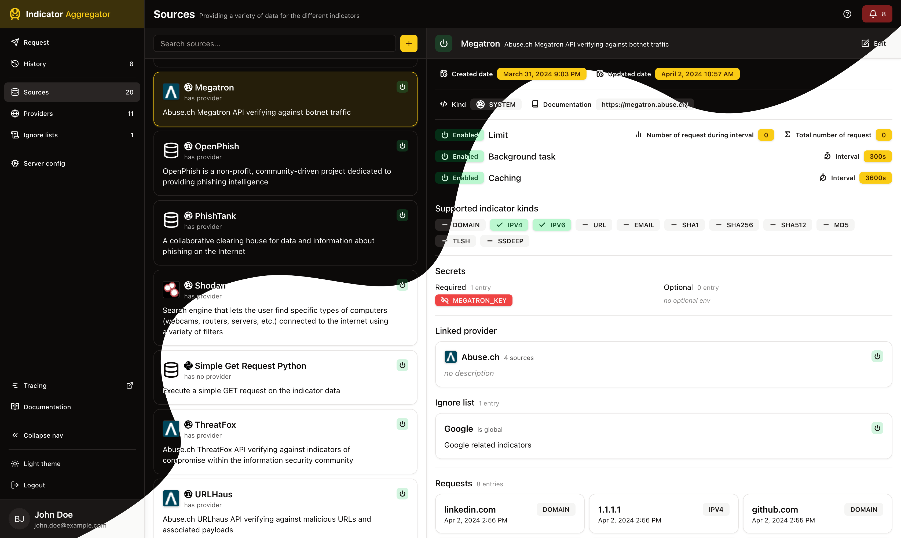

# Indicator Aggregator

A centralized platform aggregating various data sources with multiple nice add-on features. The backend is written in Rust and the frontend is in TypeScript using React.



## Why centralized?

Centralizing external requests and responses allows for:
  * a normalized request handling (rate limiting, caching, proxying, …)
  * a common response format (error, success, timeouts,…)
  * a centralized caching mechanism
  * a global ignore list
  * built-in limit and quota management
  * secret management
  * background tasks
  * metrics/logs
  * authentication

By having all of these already built, creating a source is as simple as configuring it and writing the code needed to correlate the data. I've seen in my field many different ways this was handled, many of which were overly complicated due to:
* having duplicated code
* having multiple disconnected microservices (while it may seem like a good idea, it's not)
* having no centralization on any of the above

## Getting started

### Docker

The entire stack can be run using Docker with the following command:

```sh
docker compose up
```

By using docker compose, any changes in the frontend or backend will be hot reloaded - Rust will recompile and the frontend will use HMR.

### Local

Alternatively, you can spin up the stack locally by following the respective `README.md` files and by having access to a PostgreSQL server instance:
- [./backend/README.md](./backend/README.md)
- [./frontend/README.md](./frontend/README.md)

## Architecture

Indicator Aggregator's architecture is defined at the [./docs/architecture.md](./docs/architecture.md) markdown file alongside other documents and diagrams.
