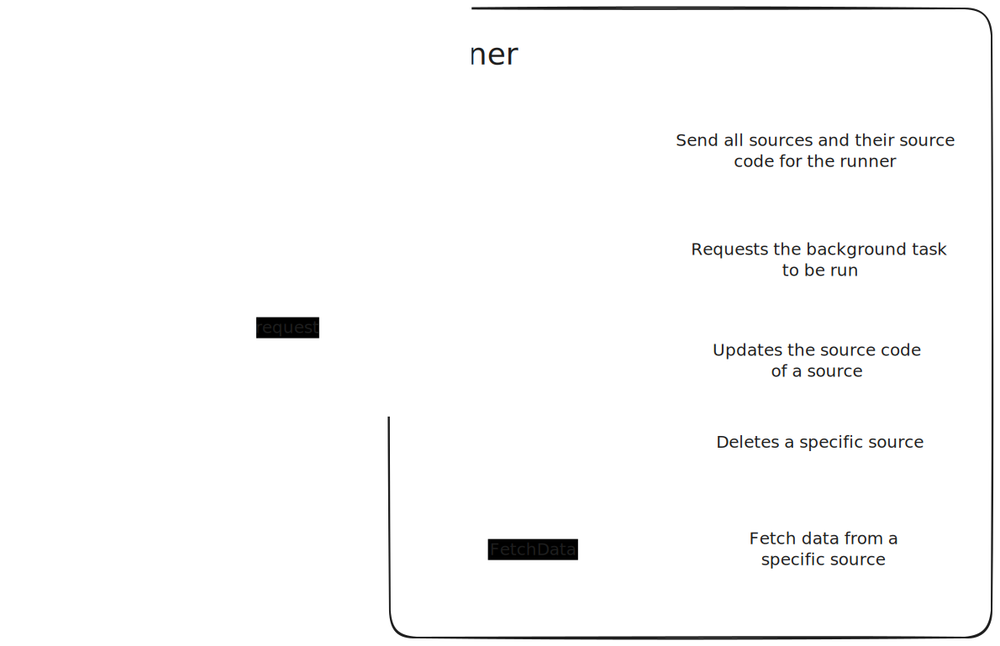

# Overall architecture

Indicator aggregator is a system composed of multiple services that are outlined below. It focuses on observability, simplicity, and performance.

> Many pieces of Indicator Aggregator are optional, they are denoted by dotted lines in the diagram above, although many should be used to have the full functionality of the service

Indicator Aggregator is composed of multiple services where the main parts are the following:
- Frontend server
  - An NGINX server serving HTML/JS/CSS files for the React frontend
  - Integrated with [Sentry.io](https://sentry.io) for error reporting - at the React level
- Backend server
  - An [Axum](https://github.com/tokio-rs/axum/) REST API
    - Uses PostgreSQL for persistence via [SQLx](https://github.com/launchbadge/sqlx)
    - Optional use of Redis for caching (or else defaults in memory), but required for rate-limiting
  - For all background tasks, this is managed on a separate thread spawning their own independent green threads (via tokio tasks)
  - Instrumented with [tracing](https://github.com/tokio-rs/tracing/) sending all traces and logs to terminal stdout and an open telemetry compatible server, [Jaeger UI](https://www.jaegertracing.io/) in this case, but could be hooked up to Elastic APM or other solutions
  - Integrated with [Sentry.io](https://sentry.io) for error reporting - at the language/Rust level
  - Requests are authenticated with one of the following (for API calls and frontend access):
    - API Tokens
    - Email and password
    - OpenID authentication providers
- Python runner server
  - A [Tonic](https://github.com/hyperium/tonic) gRPC server
    - Has Python installed on the server and uses [PyO3](https://pyo3.rs/) to invoke Python code from Rust
- JavaScript runner server
  - A [Tonic](https://github.com/hyperium/tonic) gRPC server

## Runners

Runners are simple gRPC servers where they need to handle a few different message as outlined above.

Scheduling of background tasks is not the responsibility of the runners, but the main backend server, where it will send `BackgroundTask` requests for specific sources.

---

To know more about the decisions made, please view related docs:
- [Frontend/Backend REST API communication](./rest-api.md)
- [gRPC inter-microservice communication](./grpc-microservice-communication.md)
- [Database IDs](./database-ids.md)
